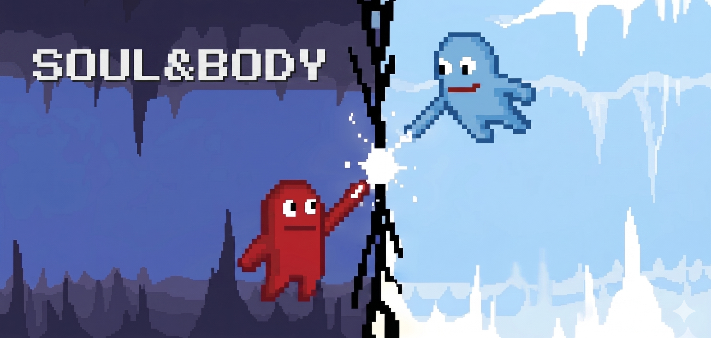
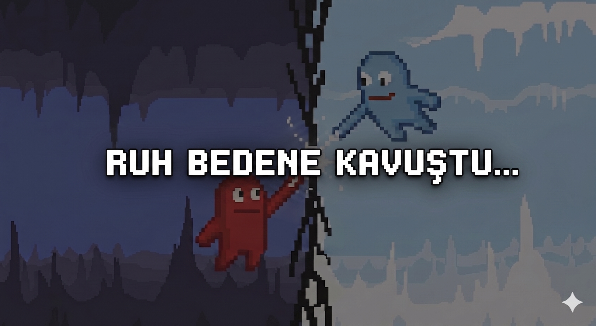

# SOUL&BODY

Bu proje Web Tabanlı Programlama dersi (veya kişisel portfolyo) kapsamında geliştirilmiştir. Sadece HTML5 Canvas ve Vanilla JavaScript kullanılarak kodlanmış, sonsuz ilerlemeli (infinite scroller) ve yerçekimi manipülasyonuna dayalı 2 boyutlu bir piksel art platform oyunudur.

Oyuncu, platformlar üzerinde hayatta kalmaya çalışırken devasa Boss Portalları ile evrenin kurallarını altüst eder. Yerçekiminin yön değiştirdiği bu macerada reflekslerinizi ve hızınızı test edin!

## 📌 Proje Linki
[https://MericAkman/SOUL-BODY.github.io/](https://github.com/MericAkman/SOUL-BODY)

## 📸 Ekran Görüntüleri

## 🎮 Nasıl Oynanır?

- Oyun yukarı saha ve sol yön tuşlarıyla oynanmaktadır.
- Özel durumlarda space ile atlamak gerekmektedir.
- Oynarken evrenin akış yönüne dikkat edilmesi gerekmektedir.
- Oyun "esc" ile duraklatılabilmektedir.

## 🔊 Özellikler

- Özel etkileşim ses efektleri
- Arkaplan müziği
- JavaScript ile oyun mekaniği
- HTML5 Canvas kullanımı
- Giderek bir noktaya kadar zorlaşan seviye sistemi

## ▶️ Oynanış Videosu

[Youtube Linki]([https://youtu.be/pnuEffFnzuQ?si=KSMqTKYe-uea5SLV](https://youtu.be/CcdmYDDoaE4))

## 📜 Credits

### 🎵 Ses ve Görsel Kaynakları

| Tür                     | Açıklama                          | Kaynak                                                                 |
|-------------------------|-----------------------------------|------------------------------------------------------------------------|
| 🎶 Arka Plan Müziği     | War - Pixabay                     | [War - Pixabay](https://pixabay.com/music/search/background%20music)            |
| 🔊 Ses Efektleri        | War - Pixabay                     | [War - Pixabay](https://pixabay.com/sound-effects/search/collectible/) |
| 🧱 Platformlar           | Brackeys_games             | [Brackeys_games](https://brackeysgames.itch.io/brackeys-platformer-bundle)      |
| 🍎 Elme                 | Brackeys_games              | [Brackeys_games](https://brackeysgames.itch.io/brackeys-platformer-bundle)        |
| 🌀 Portallar           | F1xtach.itch       | [F1xtach.itch](https://f1xtach.itch.io/pixel-art-portal) |
| 🏃 Karakter  | Segnah.itch                 | [Segnah.itch](https://segnah.itch.io/meppo?download)          |
| 🤖 Arka Plan     | AI ile üretilmiştir               | —                                                                      |

---

### 🎥 İlham Alınan / İzlenen Videolar ve Orijinal Oyun Linki

- [Coding Challenge 184: Collisions Without a Physics Library!](https://youtu.be/dJNFPv9Mj-Y?si=cvyiybavjj1uP-SY)
- [Simple to advanced collision detection using vanilla JavaScript and HTML Canvas (VWD - Lecture 7)](https://www.youtube.com/watch?v=Uv8N6OS7V_k&t=4987s)
- [Dice of Fate](https://twinfox.itch.io/dice-of-fate)

---

Bu proje **bitkicayi-Burak Ege Yaşar- tarafından** geliştirilmiştir.
